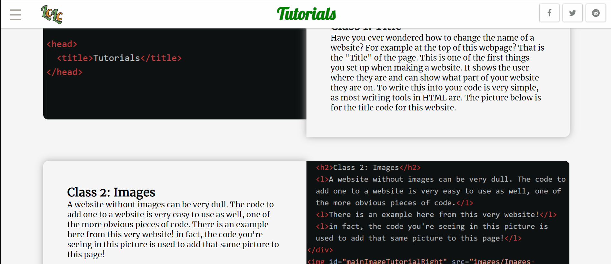

# Misbits-Non-Profit-Website  
* [Live site](https://metagawa.github.io/Misbits-Non-Profit-Website/)  

  
A website for a coding learning centre non profit  

## Built With

* [HTML](https://en.wikipedia.org/wiki/HTML)    
* [CSS](https://en.wikipedia.org/wiki/Cascading_Style_Sheets)  

## Acknowledgments

--Built by--  
* Tom Carey
* Jim Ryan  
* Ian Rowland  
* Benjamin Setterfield  
 

